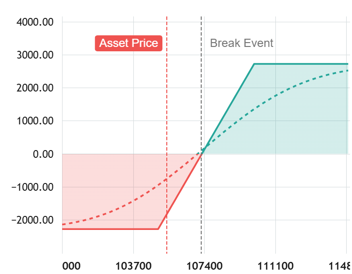

## 📈 Option Payoff Chart 

A lightweight and interactive JavaScript library to visualize option payoff diagrams based on TradingView's powerful Lightweight Charts. Perfect for traders, educators, and developers building financial tools or option strategy visualizations.



[Demo Light Version](https://phoutkham.github.io/payoff-chart/example_light.html)

[Demo Dark Version](https://phoutkham.github.io/payoff-chart/example_dark.html)

### 🚀 Features

* ⚡ Based on TradingView’s ultra-fast Lightweight Charts

* 🎨 Customizable colors, breakeven lines, and PnL zones

* 📱 Works in all modern browsers

* 🛠️ Easy integration with any JavaScript/ES6 project

## 📦 Installation

```bash
  npm install payoff-chart
```

Or via CDN:

```html
<script src="https://unpkg.com/option-payoff-chart"></script>
```

### installation for React-App

```bash
  npm install payoff-chart
```

```js
import { useEffect } from 'react';
import Payoffchart from 'payoff-chart';

function App() {

  useEffect(() => {
    const payoffchart = new Payoffchart('payoff-chart', { width: 400, height: 300 });
    
    payoffchart.setExpiryPriceLine([
      { strike: 100, value: 1 },
      { strike: 110, value: 1 },
      { strike: 120, value: -1 }
    ])}, []);

  return (
    <div id="payoff-chart"></div>
  );
}

export default App;
```

## 🛠️ Usage

Creating a basic payoff chart.

```js
import Payoffchart from 'payoff-chart';

const payoffchart = new Payoffchart('payoff-chart', { width: 400, height: 300 });

payoffchart.setExpiryPriceLine([
  { strike: 100, value: 1 },
  { strike: 110, value: 1 },
  { strike: 120, value: -1 }
]);

payoffchart.setTodayPriceLine([
  { strike: 100, value: 1 },
  { strike: 120, value: -1 },
]);

/* adding the vertical line */
payoffchart.addVertLine({
  strikePrice: 110,
  value: 1,
  options: {
    labelText: 'Break Event',
    color: '#777',
    labelTextColor: '#777'
  }
});
```

adding or removing the vertical line.

```js
/* adding the vertical line */
const breakEventLine = payoffchart.addVertLine({
  strikePrice: 110,
  value: 1,
  options: {
    labelText: 'Break Event',
    color: '#777',
    labelTextColor: '#777'
  }
});

/* removing the vertical line */
payoffchart.removeVertLine(breakEventLine);
```