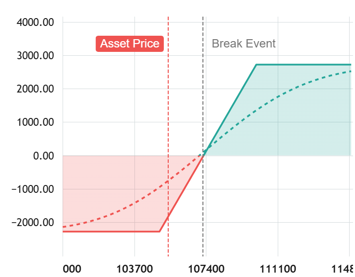

## 📈 Option Payoff Chart 

A lightweight and interactive JavaScript library to visualize option payoff diagrams based on TradingView's powerful Lightweight Charts. Perfect for traders, educators, and developers building financial tools or option strategy visualizations.



### 🚀 Features

* ⚡ Based on TradingView’s ultra-fast Lightweight Charts

* 🎨 Customizable colors, breakeven lines, and PnL zones

* 📱 Works in all modern browsers

* 🛠️ Easy integration with any JavaScript/ES6 project

## 📦 Installation

```bash
  npm run test
```